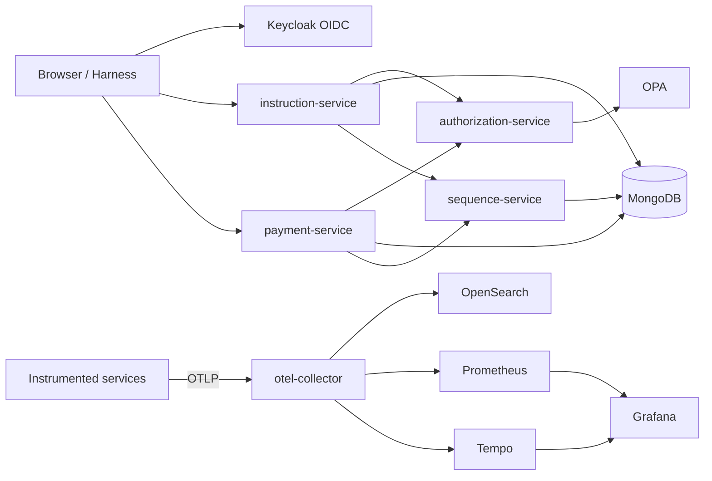

# SRE Catalog

Policy-aware SSI microservices platform in Java — a trimmed port of [policy-pilot](https://github.com/sanjuthomas/policy-pilot) focused on **MongoDB-only** persistence, **Keycloak OIDC**, **OPA authorization**, and **observability** (logs, metrics, traces) via OpenTelemetry, Prometheus, Tempo, Grafana, and OpenSearch.

OpenSLO documents are authored in [open-slo-repository](https://github.com/sanjuthomas/open-slo-repository) (included in Docker Compose). Grafana SLO dashboards compiled from those definitions are planned as a follow-on.

## Architecture



OpenSLO authoring (`open-slo-repository`) is part of the stack but omitted here; it will be shown in a separate diagram when SLO dashboard flow is added.

**In scope:** instruction, payment, authorization, and sequence services; demo harness; per-service browser UIs; OPA policies; Keycloak seed; OpenSLO repository; metrics and trace visualization.

**Out of scope (by design):** Kafka, Neo4j, indexer, chat/RAG.

## Stack

| Layer | Technology |
|-------|------------|
| Language | Java 21 |
| Framework | Spring Boot 4.1.x |
| Build | Maven Wrapper (`./mvnw`) |
| Identity | Keycloak (OIDC) |
| Policy | OPA (Rego) |
| Data | MongoDB replica set |
| SLO authoring | [open-slo-repository](https://github.com/sanjuthomas/open-slo-repository) |
| Observability | OTel Collector, Prometheus, Tempo, Grafana, OpenSearch, OpenSearch Dashboards |
| Quality gate | JaCoCo ≥ 80% per module (`./mvnw verify`) |

See [AGENTS.md](AGENTS.md) for agent/coding conventions.

## Quick start

```bash
# Full stack + demo seed (builds images, seeds Keycloak users, loads demo data)
./scripts/seed-demo-data.sh

# Or manually:
docker compose up -d --build
# Wait for keycloak-seed to finish, then seed demo data only:
./scripts/seed-demo-data.sh --seed-only
```

Default demo password: `Password1!` (see [keycloak-seed/users.yaml](keycloak-seed/users.yaml)).

If another Docker stack already uses names like `mongodb` or `opensearch`, stop it first or Compose will fail with a container name conflict.

## Service URLs

| URL | Service |
|-----|---------|
| http://localhost:9000/ui/ | Instruction browser |
| http://localhost:9093/ui/ | Payment browser |
| http://localhost:9094/ui/ | Authorization user directory |
| http://localhost:9091 | Demo harness |
| http://localhost:9090 | OpenSLO repository (`openslo` / `openslo123`) |
| http://localhost:9080 | Keycloak admin (`admin` / `admin`) |
| http://localhost:3000 | Grafana (`admin` / `admin`) — metrics & traces |
| http://localhost:9092 | Prometheus UI |
| http://localhost:3200 | Tempo API |
| http://localhost:5601 | OpenSearch Dashboards — logs |
| http://localhost:9181 | OPA |

## Development

```bash
./mvnw verify                    # tests + JaCoCo gate
./mvnw -pl instruction-service spring-boot:run
```

Run backing infrastructure and peer services:

```bash
docker compose up -d mongodb mongo-init opa opa-policy-seed keycloak keycloak-seed \
  otel-collector opensearch opensearch-dashboards prometheus tempo grafana \
  sequence-service authorization-service
```

Point a locally running service at the collector with `OTEL_EXPORTER_OTLP_ENDPOINT=http://localhost:4317`.

## Repository layout

```
.
├── shared/                  # Common libraries (auth, authz client, telemetry, …)
├── instruction-service/
├── payment-service/
├── authorization-service/
├── sequence-service/
├── demo-harness/
├── keycloak-seed/
├── opa-policy-seed/
├── prometheus/              # Prometheus scrape config (otel-collector metrics)
├── tempo/                   # Tempo trace storage config
├── grafana/                 # Grafana datasource provisioning
├── otel-collector-config.yaml
├── docker-compose.yml
└── scripts/seed-demo-data.sh
```

## Observability

### Signal flow

Instrumented Spring services (`instruction-service`, `payment-service`, `authorization-service`, `sequence-service`) depend on `shared/sre-catalog-telemetry`, which bundles:

- **Metrics** — Micrometer OTLP export (`management.otlp.metrics.export.url`)
- **Traces** — OpenTelemetry Spring Boot starter (`otel.exporter.otlp.endpoint`, `OTEL_EXPORTER_OTLP_*` env vars)

Docker Compose sets a shared OTLP endpoint and per-service `OTEL_SERVICE_NAME`. The collector fans out to backends:

| Signal | App export | Collector pipeline | Storage | View in |
|--------|------------|-------------------|---------|---------|
| **Logs** | OTLP | `logs` → OpenSearch | `otel-logs*` index | OpenSearch Dashboards (index pattern `otel-logs*`) |
| **Metrics** | OTLP | `metrics` → Prometheus exporter `:8889` | Prometheus TSDB | Grafana → Explore → Prometheus |
| **Traces** | OTLP | `traces` → Tempo | Tempo local storage | Grafana → Explore → Tempo |

Grafana at http://localhost:3000 is pre-provisioned with Prometheus and Tempo datasources.

### Try it

1. Start the stack and seed demo data: `./scripts/seed-demo-data.sh`
2. Open Grafana → **Explore** → **Prometheus** — e.g. `rate(http_server_requests_seconds_count{service_name="instruction-service"}[5m])`
3. Open Grafana → **Explore** → **Tempo** — search by `service.name` (e.g. `instruction-service`)
4. For logs, use OpenSearch Dashboards (index pattern `otel-logs*`)

`demo-harness` and `open-slo-repository` are not on the shared telemetry module yet.

### OpenSLO

The `open-slo-repository` service stores OpenSLO v1 documents in MongoDB (`open-slo` database, `service-level-objectives` collection) on the same MongoDB instance as the application services. Compiling those definitions into Grafana SLO dashboards is planned as a separate step.

## Reset

```bash
docker compose down -v --remove-orphans
docker compose up -d --build
./scripts/seed-demo-data.sh --seed-only
```
