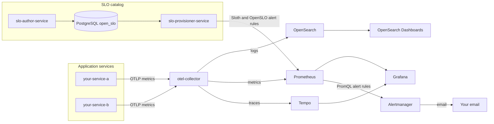
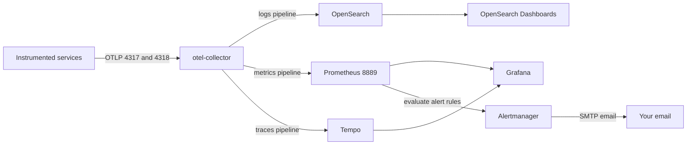
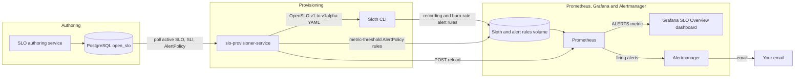
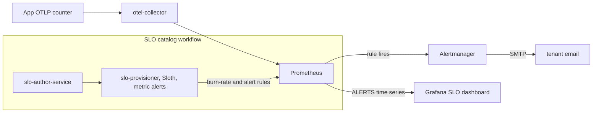

# Observability Mesh

**Observability Mesh** is a lightweight, vendor-free operating model for decentralized observability ownership. The core principle is simple: observability is part of the application — owned and operated by the team that ships it — not shared infrastructure that every service feeds into.

This repository is a reference implementation for **federated SRE ownership**: application teams get isolated observability tenants, while the platform team publishes the golden catalog, instrumentation contract, SLO workflow, and upgrade path. It includes a composable open-source stack (logs, metrics, traces, SLO authoring) and a demo workload you can replace with your own services.

The default demo is [payment-ofac-demo](workloads/payment-ofac-demo/README.md). The root `docker-compose.yml` is a convenience shim to start it from the repo root.

## Why I built this

In large enterprises, observability is often run by centralized platform teams with fancy, expensive tooling. That works when you are one of the big hitters — the high-traffic services whose telemetry justifies the spend. But if you run a small application, you may not need most of what those platforms offer. You still get pulled onto the same stack so the cost can be shared across the estate.

At the other end of the spectrum, a small company wants reliable operations without buying an enterprise suite or hiring a dedicated SRE team on day one. You need logs, metrics, traces, and a path toward SLOs — but with a **minimum viable feature set**, not every bell and whistle.

This repo is my answer: a **service reliability catalog** assembled from open-source and free tools, wired together so you can run a small application with a full observability stack — the same way data mesh thinking lets teams own their data products without waiting on a central warehouse team. Call it an **observability mesh**: each service exports OTLP, the catalog provides the shared backends (Prometheus, Tempo, Grafana, OpenSearch), and OpenSLO gives you a portable way to define what “good” looks like before you outgrow the setup.

You can swap the included demo workload for your own services and keep the mesh. The **SLO catalog** (`slo-author-service` + `slo-provisioner-service`) uses **PostgreSQL** so the mesh path stays on fully OSI-open-source storage.

## Who this is for

**Enterprise observability leaders** exploring a federated model — platform teams publish composable building blocks; application teams own isolated tenants (storage, cardinality, SLIs). This repo is a reference composition and architecture practice, not a turnkey enterprise product yet.

**Startups and builders** who want a full open-source observability stack with a working demo — clone, run `docker compose up`, and replace the demo services with your own while keeping the mesh.

## Architecture

Each workload composes the platform mesh alongside its application services. Telemetry flows through a single collector per tenant; SLO documents live in that tenant's PostgreSQL catalog.



See [workloads/payment-ofac-demo/README.md](workloads/payment-ofac-demo/README.md) for a full end-to-end demo (SSI payments, OFAC scans, Keycloak, OPA, MongoDB).

## Observability

### OTLP flow

Instrumented services export logs, metrics, and traces over OTLP to the tenant collector, which fans out to the storage backends below.



### Signal flow

Platform services (`slo-author-service`, `slo-provisioner-service`) and workloads ship shared telemetry libraries under `shared/` (Micrometer OTLP metrics, OpenTelemetry traces). Docker Compose sets a shared OTLP endpoint and per-service `OTEL_SERVICE_NAME`. The collector fans out to backends:

| Signal | App export | Collector pipeline | Storage | View in |
|--------|------------|-------------------|---------|---------|
| **Logs** | OTLP | `logs` → OpenSearch | `otel-logs*` index | OpenSearch Dashboards (index pattern `otel-logs*`) |
| **Metrics** | OTLP | `metrics` → Prometheus exporter `:8889` | Prometheus TSDB | Grafana → Explore → Prometheus |
| **Traces** | OTLP | `traces` → Tempo | Tempo local storage | Grafana → Explore → Tempo |
| **Alerts** | Metrics (PromQL rules) | Prometheus evaluates rules → Alertmanager | Alert state + email | Alertmanager UI; Grafana SLO dashboard (`ALERTS`) |

Grafana is pre-provisioned with Prometheus and Tempo datasources, plus the **SLO Overview (Sloth)** dashboard under the **SLOs** folder.

**Alerting is metric-based, not log-based.** Applications emit counters and histograms over OTLP; Prometheus evaluates PromQL alert rules. **SLO burn-rate alerts** are generated by Sloth from OpenSLO `SLO` + `SLI` documents authored in `slo-author-service` and provisioned by `slo-provisioner-service`. **Metric-threshold alerts** (e.g. payment-approval security) use OpenSLO `AlertPolicy` + `AlertCondition` + `SLI` (`thresholdMetric`) in the same catalog; `slo-provisioner-service` compiles them to `alert-*.yml` Prometheus rules. OpenSearch logs and MongoDB security-event documents are for search and audit — they do not drive the email alert path today.

Configuration: [otel-collector-config.yaml](otel-collector-config.yaml), [prometheus/prometheus.yml](prometheus/prometheus.yml), [tempo/tempo.yaml](tempo/tempo.yaml), [grafana/](grafana/).

### OpenSLO → Sloth → Prometheus

`slo-provisioner-service` is a Spring Boot batch worker (poll every 60s) that keeps Prometheus recording rules in sync with active OpenSLO documents in **PostgreSQL** (`open_slo` database, `service_level_objectives` table). Each tenant runs its own provisioner and Prometheus; the **rules volume** is local to that tenant and mounted by both services so Sloth output lands where Prometheus loads it — not shared across application teams.



1. Read active `kind=SLO` rows from `service_level_objectives`; resolve `spec.indicatorRef` to the active `kind=SLI` document.
2. Compile OpenSLO v1 + SLI `ratioMetric` queries into OpenSLO v1alpha YAML for Sloth (inlines PromQL, maps `30d` windows, normalizes `[5m]` → `[{{.window}}]`).
3. Run `sloth generate` and write `{sloName}.yml` under the tenant's Prometheus rules directory (recording **and** burn-rate alert rules); archive removed SLOs to `_archive/` (orphan policy: drop rules, mark `ARCHIVED` in `slo_provision_state` — Grafana objects are not deleted).
4. `POST` Prometheus `/-/reload` when rules change.

For **metric-threshold alerts**, the provisioner also polls active `kind=AlertPolicy` documents, resolves the referenced `AlertCondition` and `SLI` (`thresholdMetric`), and writes `alert-{policyName}.yml` into the same rules volume. `AlertCondition` metadata must include `observability-mesh.alert-type: metric-threshold` and `observability-mesh.sli-ref: <sli-name>`.

**SLO provisioner browser** — http://localhost:9097/ui/ lists active documents from PostgreSQL together with provision status (`ACTIVE`, `FAILED`, `ARCHIVED`, `NOT_PROVISIONED`); open a row for indicator PromQL, generated Prometheus recording rules YAML, and the source OpenSLO JSON. Authentication is configured per workload (Keycloak JWT in the default demo).

**SLO authoring** — `slo-author-service` (port 9090) is where developers author, validate, and version OpenSLO v1 documents through a browser UI and REST API. Documents are validated with the [open-slo-java-sdk](https://github.com/sanjuthomas/open-slo-java-sdk) and stored in PostgreSQL (`service_level_objectives` table with JSONB `content`). `slo-provisioner-service` then reads those active SLOs and translates them into Prometheus rules via Sloth.

Workloads seed tenant-specific SLIs/SLOs via `postgres/seed-slos.sql` and set `OBSERVABILITY_MESH_SLO_PROVISIONER_DATASOURCE_NAMES` to match their Prometheus datasource labels.

## Stack

| Layer | Technology |
|-------|------------|
| Language | Java 21 |
| Framework | Spring Boot 4.1.x |
| Build | Maven Wrapper (`./mvnw`) |
| SLO catalog | PostgreSQL (`open_slo`) |
| SLO authoring | `slo-author-service` (OpenSLO v1 + [open-slo-java-sdk](https://github.com/sanjuthomas/open-slo-java-sdk)) |
| SLO provisioning | [Sloth](https://github.com/slok/sloth) → Prometheus recording + alert rules |
| Alerting | Prometheus + Alertmanager (metric-based; email via SMTP) |
| Observability | OTel Collector, Prometheus, Tempo, Grafana, OpenSearch, OpenSearch Dashboards |
| Quality gate | JaCoCo ≥ 80% per module (`./mvnw verify`) |

Workloads add their own persistence, identity, and policy layers (the default demo uses MongoDB, Keycloak, and OPA — see [payment-ofac-demo](workloads/payment-ofac-demo/README.md)).

See [AGENTS.md](AGENTS.md) for agent/coding conventions.

## Operating model

The target deployment model is **one isolated tenant per application team** — not a shared observability platform where every service feeds the same Prometheus.

Each application team runs **its own composed mesh**: dedicated collector, Prometheus, Tempo, Grafana, OpenSearch, SLO authoring, and provisioner instances (or namespace-equivalent isolation in Kubernetes). Telemetry, storage, cardinality, retention, and SLO quality stay inside that tenant boundary. If a team emits high-cardinality labels or writes SLIs that do not match their metrics, **that is their problem** — it does not affect other teams.

The centralized observability team does **not** phase out. It curates and publishes the **building blocks** that make per-team composition possible: patched images, reference Compose/Helm manifests, instrumentation libraries, and environment contracts. Application teams pull those artifacts, compose the mesh alongside their services, and own day-2 operations within their tenant.

| Responsibility | Centralized observability team | Application team (per tenant) |
|----------------|-------------------------------|------------------------------|
| **Platform images & versions** | Build, patch, and publish curated images for the collector, Prometheus, Tempo, Grafana, OpenSearch, and mesh services (e.g. `slo-author-service`, `slo-provisioner-service`) | Deploy pinned versions from the platform catalog into **their** tenant; do not fork or patch base images locally |
| **Storage & capacity** | Document sizing guidance and publish volume/retention patterns in reference manifests | Provision and operate **their** backing storage; own growth, retention, backups, and cardinality budgets |
| **Security & compliance** | Apply security patches, define TLS/secrets patterns, and publish upgrade schedules for platform images | Configure auth, secrets, and network policy within **their** tenant |
| **Instrumentation** | Maintain shared libraries (e.g. `observability-mesh-telemetry`) and OTLP export conventions | Instrument services, set `OTEL_SERVICE_NAME`, emit metrics/traces/logs to **their** collector |
| **SLOs & reliability goals** | Ship Sloth provisioning, baseline Grafana datasources, and reference dashboards as part of the catalog | Author OpenSLO documents, run **their** `slo-author-service` / `slo-provisioner-service`, and review **their** burn-rate dashboards |
| **Compose & run** | Publish reference Compose/Kubernetes manifests and environment contracts (ports, env vars, volume mounts) | Compose and operate a full mesh stack for **their** application; add app-specific scrape labels and SLO namespaces |

In this repo, each workload **includes** the shared platform compose ([platform/docker-compose.yml](platform/docker-compose.yml)) and adds its own services. The platform team owns `platform/`; workload teams own `workloads/<name>/` and override platform settings (SLO seeds, provisioner datasource names, auth) without forking platform code.

See [workloads/_template/README.md](workloads/_template/README.md) for running multiple isolated tenants in parallel (`PORT_BLOCK` port offsets).

### Explore in Grafana

Grafana: http://localhost:3000 (`admin` / `admin`). Host port follows the workload `.env` (`GRAFANA_PORT`; default `3000` with `PORT_BLOCK=0`).

**SLO dashboard**

1. **Dashboards** → **SLOs** → **SLO Overview (Sloth)**
2. Choose **service** and **SLO** from the dropdowns at the top
3. Review objective, SLI attainment, burn rate, and error-budget panels

Data appears after OpenSLO documents are seeded, `slo-provisioner-service` has generated Sloth rules (poll ~60s), and application metrics match the SLI PromQL. Seed commands, service names, and SLO names are workload-specific — see your workload README.

**Traces**

1. **Explore** (compass icon) → datasource **Tempo**
2. **Search** → filter by **Service name** (`service.name` — matches each container's `OTEL_SERVICE_NAME`)
3. Set the time range (e.g. **Last 15 minutes**), run the query, and open a trace for the span waterfall

Generate traffic first (workload seed script or normal API calls). Only instrumented services export traces.

**Email alerts (metric-based)**

Alerts are driven by **Prometheus metrics and PromQL rules** — not log or audit-store queries.



Prometheus routes firing alerts to **Alertmanager** (http://localhost:9098 by default). Configure SMTP in the workload `.env` (`ALERTMANAGER_SMTP_*`, `ALERTMANAGER_EMAIL_TO`). Without SMTP, alerts still appear in Prometheus and the Grafana SLO dashboard.

Workload-specific alert names, triggers, and verification steps live in that workload's README — for the default demo see [payment-ofac-demo Explore in Grafana](workloads/payment-ofac-demo/README.md#explore-in-grafana).

## Quick start

**Default demo workload** (platform + SSI payment/OFAC services):

```bash
# Full stack + demo seed (builds images, seeds Keycloak users, loads demo data)
./workloads/payment-ofac-demo/scripts/seed-demo-data.sh

# Or manually from repo root (convenience shim):
docker compose up -d --build

# Or from the workload directory (canonical entry point):
docker compose -f workloads/payment-ofac-demo/docker-compose.yml up -d --build
```

**New workload** — copy [workloads/_template/](workloads/_template/) and follow [workloads/_template/README.md](workloads/_template/README.md).

Each workload can set unique host ports via `.env` (`PORT_BLOCK`). Do not use global `container_name` values — compose project name scopes containers per tenant.

## Platform URLs

Default ports with `PORT_BLOCK=0` (payment-ofac-demo). Other workloads add `PORT_BLOCK` to each host port — see that workload's `.env.example`.

| URL | Service | Auth (default demo) |
|-----|---------|---------------------|
| http://localhost:9090/ui/ | SLO authoring service | Keycloak (workload) |
| http://localhost:9097/ui/ | SLO provisioner browser | Keycloak (workload) |
| http://localhost:3000 | Grafana — metrics & traces | `admin` / `admin` |
| http://localhost:9092 | Prometheus UI | — |
| http://localhost:9098 | Alertmanager UI | — |
| http://localhost:3200 | Tempo API | — |
| http://localhost:5601 | OpenSearch Dashboards — logs | — |
| http://localhost:5432 | PostgreSQL (`open_slo`) | — |

Workload application UIs (instruction, payment, OFAC, harness, Keycloak, OPA) are documented in [workloads/payment-ofac-demo/README.md](workloads/payment-ofac-demo/README.md).

## Development

```bash
./mvnw verify                    # tests + JaCoCo gate (all modules)
./mvnw -pl slo-author-service spring-boot:run
./mvnw -pl slo-provisioner-service spring-boot:run
```

Run the full stack for integration work:

```bash
docker compose up -d   # repo-root shim → platform + default workload
```

Point a locally running service at the collector with `OTEL_EXPORTER_OTLP_ENDPOINT=http://localhost:4318` (or the workload's `OTEL_HTTP_PORT`).

Workload-specific Maven targets: [workloads/payment-ofac-demo/README.md](workloads/payment-ofac-demo/README.md#development).

## Repository layout

```
.
├── platform/
│   ├── docker-compose.yml           # observability mesh bundle (included by workloads)
│   └── README.md
├── shared/                          # Platform libraries (auth, common, telemetry)
├── workloads/
│   ├── _template/                   # copy to create isolated parallel tenants
│   └── payment-ofac-demo/           # default demo workload (SSI + OFAC)
├── slo-author-service/              # OpenSLO authoring UI + API
├── slo-provisioner-service/         # OpenSLO → Sloth → Prometheus rules batch + browser UI
├── prometheus/                      # Prometheus config, Alertmanager, security alert rules
├── tempo/                           # Tempo trace storage config
├── grafana/                         # Grafana datasource + SLO dashboard provisioning
├── otel-collector-config.yaml       # Collector pipelines (logs, metrics, traces)
└── docker-compose.yml               # shim → workloads/payment-ofac-demo/docker-compose.yml
```

## Reset

```bash
docker compose down -v --remove-orphans
docker compose up -d --build
```

For the default demo workload, re-seed application data: `./workloads/payment-ofac-demo/scripts/seed-demo-data.sh --seed-only`.
