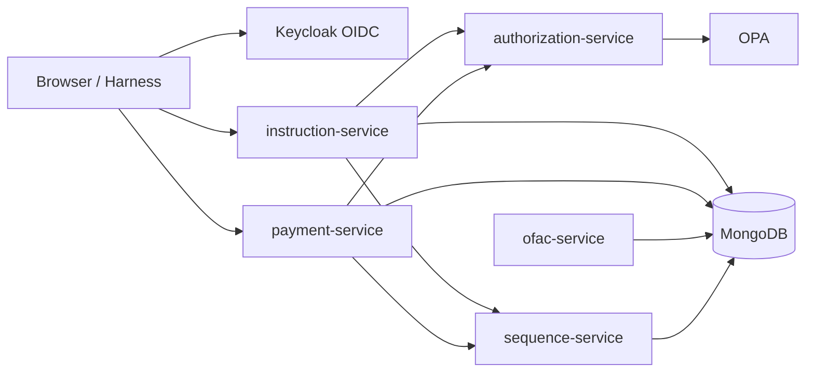
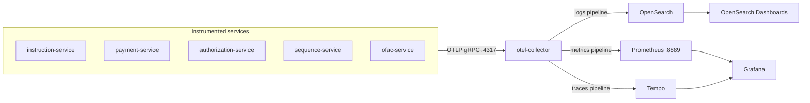

# Observability Mesh

Reference stack for an **observability mesh** — logs, metrics, traces, OpenSLO authoring, and the backends to explore SLIs and SLO dashboards without enterprise platform overhead.

The policy-aware SSI microservices platform is the **demo workload**: a trimmed Java port of [policy-pilot](https://github.com/sanjuthomas/policy-pilot) that exercises the catalog end-to-end. It generates realistic telemetry and business events (including sanction-scan latency) so you can see how the pieces fit together without building a production payments system first.

OpenSLO documents are authored in `slo-author-service` (a Keycloak-secured Spring Boot service and browser UI in this monorepo). `slo-provisioner-service` compiles active SLOs through [Sloth](https://github.com/slok/sloth) into Prometheus recording rules for Grafana SLO dashboards (import [dashboard 14348](https://grafana.com/grafana/dashboards/14348-sloth-slo/) in Grafana OSS).

## Why I built this

In large enterprises, observability is often run by centralized platform teams with fancy, expensive tooling. That works when you are one of the big hitters — the high-traffic services whose telemetry justifies the spend. But if you run a small application, you may not need most of what those platforms offer. You still get pulled onto the same stack so the cost can be shared across the estate.

At the other end of the spectrum, a small company wants reliable operations without buying an enterprise suite or hiring a dedicated SRE team on day one. You need logs, metrics, traces, and a path toward SLOs — but with a **minimum viable feature set**, not every bell and whistle.

This repo is my answer: a **service reliability catalog** assembled from open-source and free tools, wired together so you can run a small application with a full observability stack — the same way data mesh thinking lets teams own their data products without waiting on a central warehouse team. Call it an **observability mesh**: each service exports OTLP, the catalog provides the shared backends (Prometheus, Tempo, Grafana, OpenSearch), and OpenSLO gives you a portable way to define what “good” looks like before you outgrow the setup.

The Java microservices here are a **demo workload** to prove the catalog works end-to-end. You can swap them for your own services and keep the mesh.

## Operating model

Application teams are the natural owners of observability for their services — they know the SLIs, write the OpenSLO documents, instrument their code, and care about whether dashboards and alerts reflect real user impact. Running a full observability stack alongside that work is a different job: image version upgrades, security patches, storage provisioning, retention policies, collector tuning, and keeping Grafana/Prometheus/Tempo/OpenSearch healthy across environments.

A practical split is to **bring the tooling closer to the application without phasing out the centralized observability team**. The platform team curates and operates the mesh **building blocks**; application teams **compose and consume** them for their own workloads.

| Responsibility | Centralized observability team | Application team |
|----------------|-------------------------------|------------------|
| **Platform images & versions** | Build, patch, and publish curated images for the collector, Prometheus, Tempo, Grafana, OpenSearch, and mesh services (e.g. `slo-author-service`, `slo-provisioner-service`) | Pull pinned versions from the platform catalog; do not fork or patch base images locally |
| **Storage & capacity** | Provision and operate backing storage (volumes, retention, backups, index lifecycle) | Declare expected signal volume and retention needs; stay within agreed quotas |
| **Security & compliance** | Apply security patches, manage TLS/secrets patterns, and run platform upgrades on a schedule | Use platform-provided auth (Keycloak OIDC), export OTLP only to approved endpoints, follow instrumentation standards |
| **Instrumentation** | Maintain shared libraries (e.g. `observability-mesh-telemetry`) and collector routing conventions | Instrument services, set `OTEL_SERVICE_NAME`, emit metrics/traces/logs over OTLP |
| **SLOs & reliability goals** | Operate Sloth provisioning, Prometheus rule reload, and baseline Grafana datasources/dashboards | Author and version OpenSLO documents, define SLIs/SLOs for their services, review burn-rate dashboards |
| **Compose & run** | Publish reference Compose/Kubernetes manifests and environment contracts (ports, env vars, volume mounts) | Compose the mesh alongside their application stack; configure app-specific scrape labels and SLO namespaces |

In this repo, `docker-compose.yml` is the **reference composition**: the platform team would own the observability service definitions and image pins; an application team adds their services, points them at the shared collector, and uses `slo-author-service` for their OpenSLO catalog. The goal is federated ownership — applications stay close to their telemetry and SLOs, while the central team absorbs the undifferentiated heavy lifting of running the stack.

## Architecture

The diagram below is the **demo application** — services, auth, policy, and persistence that drive the catalog.



OpenSLO authoring (`slo-author-service`) and SLO provisioning (`slo-provisioner-service`) are part of the stack but omitted here; see **OpenSLO → Sloth → Prometheus** under Observability for that path.

**In scope:** instruction, payment, authorization, sequence, OFAC (sanction scan simulator), SLO author, and SLO provisioner services; demo harness; per-service browser UIs; OPA policies; Keycloak seed; metrics and trace visualization.

**Out of scope (by design):** Kafka, Neo4j, indexer, chat/RAG.

## Observability

This is the core of the catalog: how signals leave the demo workload and land in stores you can query.

### OTLP flow

Instrumented Spring services export logs, metrics, and traces over OTLP to a single collector, which fans out to the storage backends below.



### Signal flow

Instrumented Spring services (`instruction-service`, `payment-service`, `ofac-service`, `authorization-service`, `sequence-service`) depend on `shared/observability-mesh-telemetry`, which bundles:

- **Metrics** — Micrometer OTLP export (`management.otlp.metrics.export.url`)
- **Traces** — OpenTelemetry Spring Boot starter (`otel.exporter.otlp.endpoint`, `OTEL_EXPORTER_OTLP_*` env vars)

Docker Compose sets a shared OTLP endpoint and per-service `OTEL_SERVICE_NAME`. The collector fans out to backends:

| Signal | App export | Collector pipeline | Storage | View in |
|--------|------------|-------------------|---------|---------|
| **Logs** | OTLP | `logs` → OpenSearch | `otel-logs*` index | OpenSearch Dashboards (index pattern `otel-logs*`) |
| **Metrics** | OTLP | `metrics` → Prometheus exporter `:8889` | Prometheus TSDB | Grafana → Explore → Prometheus |
| **Traces** | OTLP | `traces` → Tempo | Tempo local storage | Grafana → Explore → Tempo |

Grafana at http://localhost:3000 is pre-provisioned with Prometheus and Tempo datasources.

### Try it

1. Start the stack and seed demo data: `./scripts/seed-demo-data.sh`
2. Open Grafana → **Explore** → **Prometheus** — e.g. `rate(http_server_requests_seconds_count{service_name="instruction-service"}[5m])`
3. Open Grafana → **Explore** → **Tempo** — search by `service.name` (e.g. `instruction-service`)
4. For logs, use OpenSearch Dashboards (index pattern `otel-logs*`)

`demo-harness` is not on the shared telemetry module yet.

### OpenSLO → Sloth → Prometheus

`slo-provisioner-service` is a Spring Boot batch worker (poll every 60s) that keeps Prometheus recording rules in sync with active OpenSLO documents in MongoDB:


1. Read active `kind=SLO` documents from `service-level-objectives`; resolve `spec.indicatorRef` to the active `kind=SLI` document.
2. Compile OpenSLO v1 + SLI `ratioMetric` queries into OpenSLO v1alpha YAML for Sloth (inlines PromQL, maps `30d` windows, normalizes `[5m]` → `[{{.window}}]`).
3. Run `sloth generate` and write `{sloName}.yml` under the shared rules directory; archive removed SLOs to `_archive/` (orphan policy: drop rules, mark `ARCHIVED` in `slo-provision-state` — Grafana objects are not deleted).
4. `POST` Prometheus `/-/reload` when rules change.

Datasource allowlist is configured in `application.properties` (`observability-mesh.slo-provisioner.datasource-names=payment-prometheus`). Emit matching metrics from the demo workload to evaluate SLOs in Grafana.

### OpenSLO authoring

`slo-author-service` (port 9090) is where developers author, validate, and version OpenSLO v1 documents through a browser UI and REST API. Documents are validated with the [open-slo-java-sdk](https://github.com/sanjuthomas/open-slo-java-sdk) and stored in MongoDB (`open-slo` database, `service-level-objectives` collection) on the same MongoDB instance as the application services. It authenticates against Keycloak (OIDC) like the other services — sign in at http://localhost:9090/ui/ with demo credentials **`admin-001`** / **`Password1!`** (any user from [keycloak-seed/users.yaml](keycloak-seed/users.yaml) works); the `/api/v1/documents/**` API is JWT-protected. `slo-provisioner-service` then reads those active SLOs and translates them into Prometheus rules via Sloth.

## Sanction scanning (OFAC)

Part of the demo workload: when a payment is **approved**, `payment-service` writes three documents in a **single MongoDB transaction**:

1. the new bitemporal payment version (`payments`),
2. a security event (`payment_service` in the `security_events` DB), and
3. an OFAC scan request (`ofac-scan-requests`) capturing payment id, owning LOB, debtor/creditor accounts, creditor name, and intermediaries.

`ofac-service` is a **fake sanction scanner** that simulates the vendor software large banks license rather than build (keeping pace with OFAC/Washington rule changes and the associated liability is hard). It runs a batch poll every **30 seconds**:

1. reads all **current** scan requests with `lifecycle_status = OPEN`,
2. claims each by appending a new version with `lifecycle_status = IN_PROGRESS`,
3. simulates the scan by waiting **30–60 seconds**, then
4. appends a final version with `lifecycle_status = PROCESSED` and a `result` of `PASSED` or `FAILED`.

Scan requests are versioned bitemporally (`in` / `out`, current sentinel `9999-12-31T23:59:59Z`) with `_id = {paymentId}|{paymentVersion}|{versionNumber}`, so each lifecycle transition is a new immutable version:

```
v1 OPEN  →  v2 IN_PROGRESS  →  v3 PROCESSED (PASSED | FAILED)
```

The simulated delay intentionally generates latency data for future **sanction scan SLI/SLO** work (e.g. time from `requested_at` to `PROCESSED`, or backlog of `OPEN` requests).

## Stack

| Layer | Technology |
|-------|------------|
| Language | Java 21 |
| Framework | Spring Boot 4.1.x |
| Build | Maven Wrapper (`./mvnw`) |
| Identity | Keycloak (OIDC) |
| Policy | OPA (Rego) |
| Data | MongoDB replica set |
| SLO authoring | `slo-author-service` (OpenSLO v1 + [open-slo-java-sdk](https://github.com/sanjuthomas/open-slo-java-sdk)) |
| SLO provisioning | [Sloth](https://github.com/slok/sloth) → Prometheus recording rules |
| Observability | OTel Collector, Prometheus, Tempo, Grafana, OpenSearch, OpenSearch Dashboards |
| Quality gate | JaCoCo ≥ 80% per module (`./mvnw verify`) |

See [AGENTS.md](AGENTS.md) for agent/coding conventions.

## Quick start

```bash
# Full stack + demo seed (builds images, seeds Keycloak users, loads demo data)
./scripts/seed-demo-data.sh

# Or manually:
docker compose up -d --build
# Wait for keycloak-seed to finish, then seed demo data only:
./scripts/seed-demo-data.sh --seed-only
```

Default demo password: `Password1!` (see [keycloak-seed/users.yaml](keycloak-seed/users.yaml)).

If another Docker stack already uses names like `mongodb` or `opensearch`, stop it first or Compose will fail with a container name conflict.

## Service URLs

| URL | Service |
|-----|---------|
| http://localhost:9000/ui/ | Instruction browser |
| http://localhost:9093/ui/ | Payment browser |
| http://localhost:9096/actuator/health | OFAC scan simulator (batch processor) |
| http://localhost:9097/actuator/health | SLO provisioner (OpenSLO → Sloth batch) |
| http://localhost:9094/ui/ | Authorization user directory |
| http://localhost:9091 | Demo harness |
| http://localhost:9090/ui/ | SLO authoring service (`admin-001` / `Password1!`) |
| http://localhost:9080 | Keycloak admin (`admin` / `admin`) |
| http://localhost:3000 | Grafana (`admin` / `admin`) — metrics & traces |
| http://localhost:9092 | Prometheus UI |
| http://localhost:3200 | Tempo API |
| http://localhost:5601 | OpenSearch Dashboards — logs |
| http://localhost:9181 | OPA |

## Development

```bash
./mvnw verify                    # tests + JaCoCo gate
./mvnw -pl instruction-service spring-boot:run
```

Run backing infrastructure and peer services:

```bash
docker compose up -d mongodb mongo-init opa opa-policy-seed keycloak keycloak-seed \
  otel-collector opensearch opensearch-dashboards prometheus tempo grafana \
  sequence-service authorization-service
```

Point a locally running service at the collector with `OTEL_EXPORTER_OTLP_ENDPOINT=http://localhost:4317`.

## Repository layout

```
.
├── shared/                  # Common libraries (auth, authz client, telemetry, …)
├── instruction-service/
├── payment-service/
├── ofac-service/            # Sanction scan simulator (batch processor)
├── slo-author-service/      # OpenSLO authoring UI + API (Keycloak OIDC)
├── slo-provisioner-service/ # OpenSLO → Sloth → Prometheus rules batch
├── authorization-service/
├── sequence-service/
├── demo-harness/
├── keycloak-seed/
├── opa-policy-seed/
├── prometheus/              # Prometheus scrape config (otel-collector metrics)
├── tempo/                   # Tempo trace storage config
├── grafana/                 # Grafana datasource provisioning
├── otel-collector-config.yaml
├── docker-compose.yml
└── scripts/seed-demo-data.sh
```

## Reset

```bash
docker compose down -v --remove-orphans
docker compose up -d --build
./scripts/seed-demo-data.sh --seed-only
```
