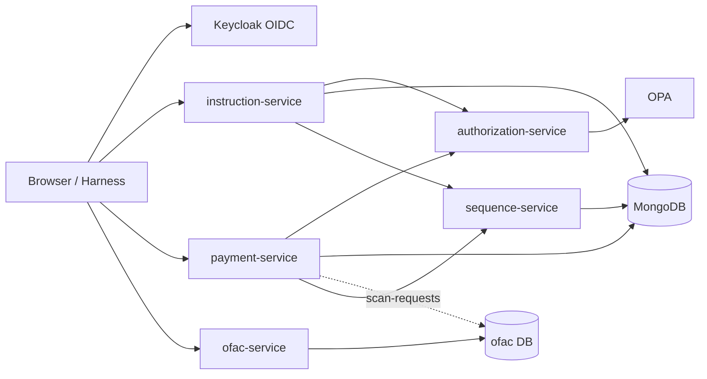
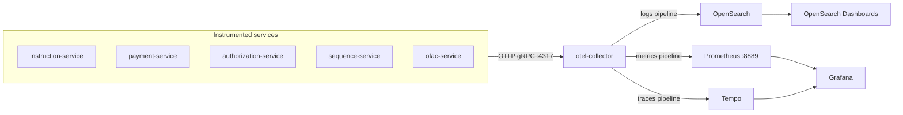
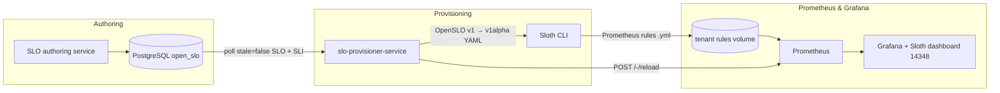

# Observability Mesh

Reference stack for **observability sovereignty without enterprise licensing** — an **observability mesh** with logs, metrics, traces, OpenSLO authoring, and the backends to explore SLIs and SLO dashboards.

The policy-aware SSI microservices platform is the **demo workload**: a trimmed Java port of [policy-pilot](https://github.com/sanjuthomas/policy-pilot) that exercises the catalog end-to-end. It generates realistic telemetry and business events (including sanction-scan latency) so you can see how the pieces fit together without building a production payments system first.

OpenSLO documents are authored in `slo-author-service` (a Keycloak-secured Spring Boot service and browser UI in this monorepo). `slo-provisioner-service` compiles active SLOs through [Sloth](https://github.com/slok/sloth) into Prometheus recording rules for Grafana SLO dashboards (import [dashboard 14348](https://grafana.com/grafana/dashboards/14348-sloth-slo/) in Grafana OSS).

## Why I built this

In large enterprises, observability is often run by centralized platform teams with fancy, expensive tooling. That works when you are one of the big hitters — the high-traffic services whose telemetry justifies the spend. But if you run a small application, you may not need most of what those platforms offer. You still get pulled onto the same stack so the cost can be shared across the estate.

At the other end of the spectrum, a small company wants reliable operations without buying an enterprise suite or hiring a dedicated SRE team on day one. You need logs, metrics, traces, and a path toward SLOs — but with a **minimum viable feature set**, not every bell and whistle.

This repo is my answer: a **service reliability catalog** assembled from open-source and free tools, wired together so you can run a small application with a full observability stack — the same way data mesh thinking lets teams own their data products without waiting on a central warehouse team. Call it an **observability mesh**: each service exports OTLP, the catalog provides the shared backends (Prometheus, Tempo, Grafana, OpenSearch), and OpenSLO gives you a portable way to define what “good” looks like before you outgrow the setup.

The Java microservices here are a **demo workload** to prove the catalog works end-to-end. You can swap them for your own services and keep the mesh. The demo app uses MongoDB (`ssi_cash_activities` for instructions and payments, `ofac` for sanction scan requests, `security_events` for audit events); the **SLO catalog** (`slo-author-service` + `slo-provisioner-service`) uses **PostgreSQL** so the mesh path stays on fully OSI-open-source storage.

## Who this is for

**Enterprise observability leaders** exploring a federated model — platform teams publish composable building blocks; application teams own isolated tenants (storage, cardinality, SLIs). This repo is a reference composition and architecture practice, not a turnkey enterprise product yet.

**Startups and builders** who want a full open-source observability stack with a working demo — clone, run `docker compose up`, and replace the demo services with your own while keeping the mesh.

## Architecture

The diagram below is the **demo application** — services, auth, policy, and persistence that drive the catalog.



OpenSLO authoring (`slo-author-service`) and SLO provisioning (`slo-provisioner-service`) are part of the stack but omitted here; see **OpenSLO → Sloth → Prometheus** under Observability for that path.

**In scope:** instruction, payment, authorization, sequence, and OFAC services; SLO author and SLO provisioner; demo harness; per-service browser UIs (instructions, payments, OFAC scans, authorization directory, OpenSLO authoring); OPA policies; Keycloak seed; metrics and trace visualization.

**Out of scope (by design):** Kafka, Neo4j, indexer, chat/RAG.

## Observability

This is the core of the catalog: how signals leave the demo workload and land in stores you can query.

### OTLP flow

Instrumented Spring services export logs, metrics, and traces over OTLP to a single collector, which fans out to the storage backends below.



### Signal flow

Instrumented Spring services (`instruction-service`, `payment-service`, `ofac-service`, `authorization-service`, `sequence-service`) depend on `shared/observability-mesh-telemetry`, which bundles:

- **Metrics** — Micrometer OTLP export (`management.otlp.metrics.export.url`)
- **Traces** — OpenTelemetry Spring Boot starter (`otel.exporter.otlp.endpoint`, `OTEL_EXPORTER_OTLP_*` env vars)

Docker Compose sets a shared OTLP endpoint and per-service `OTEL_SERVICE_NAME`. The collector fans out to backends:

| Signal | App export | Collector pipeline | Storage | View in |
|--------|------------|-------------------|---------|---------|
| **Logs** | OTLP | `logs` → OpenSearch | `otel-logs*` index | OpenSearch Dashboards (index pattern `otel-logs*`) |
| **Metrics** | OTLP | `metrics` → Prometheus exporter `:8889` | Prometheus TSDB | Grafana → Explore → Prometheus |
| **Traces** | OTLP | `traces` → Tempo | Tempo local storage | Grafana → Explore → Tempo |

Grafana at http://localhost:3000 is pre-provisioned with Prometheus and Tempo datasources.

### Try it

1. Start the stack and seed demo data: `./scripts/seed-demo-data.sh`
2. Open Grafana → **Explore** → **Prometheus** — e.g. `rate(http_server_requests_seconds_count{service_name="instruction-service"}[5m])`
3. Open Grafana → **Explore** → **Tempo** — search by `service.name` (e.g. `instruction-service`)
4. For logs, use OpenSearch Dashboards (index pattern `otel-logs*`)

`demo-harness` is not on the shared telemetry module yet.

### OpenSLO → Sloth → Prometheus

`slo-provisioner-service` is a Spring Boot batch worker (poll every 60s) that keeps Prometheus recording rules in sync with active OpenSLO documents in **PostgreSQL** (`open_slo` database, `service_level_objectives` table). Each tenant runs its own provisioner and Prometheus; the **rules volume** is local to that tenant and mounted by both services so Sloth output lands where Prometheus loads it — not shared across application teams.



1. Read active `kind=SLO` rows from `service_level_objectives`; resolve `spec.indicatorRef` to the active `kind=SLI` document.
2. Compile OpenSLO v1 + SLI `ratioMetric` queries into OpenSLO v1alpha YAML for Sloth (inlines PromQL, maps `30d` windows, normalizes `[5m]` → `[{{.window}}]`).
3. Run `sloth generate` and write `{sloName}.yml` under the tenant's Prometheus rules directory; archive removed SLOs to `_archive/` (orphan policy: drop rules, mark `ARCHIVED` in `slo_provision_state` — Grafana objects are not deleted).
4. `POST` Prometheus `/-/reload` when rules change.

Datasource allowlist is configured in `application.properties` (`observability-mesh.slo-provisioner.datasource-names=payment-prometheus`). Emit matching metrics from the demo workload to evaluate SLOs in Grafana.

### OpenSLO authoring

`slo-author-service` (port 9090) is where developers author, validate, and version OpenSLO v1 documents through a browser UI and REST API. Documents are validated with the [open-slo-java-sdk](https://github.com/sanjuthomas/open-slo-java-sdk) and stored in **PostgreSQL** (`open_slo` database, `service_level_objectives` table with JSONB `content`). It authenticates against Keycloak (OIDC) like the other services — sign in at http://localhost:9090/ui/ with demo credentials **`admin-001`** / **`Password1!`** (any user from [keycloak-seed/users.yaml](keycloak-seed/users.yaml) works); the `/api/v1/documents/**` API is JWT-protected. `slo-provisioner-service` then reads those active SLOs and translates them into Prometheus rules via Sloth.

## Sanction scanning (OFAC)

Part of the demo workload: when a payment is **approved**, `payment-service` writes three documents in a **single MongoDB transaction**:

1. the new bitemporal payment version (`payments`),
2. a security event (`payment_service` in the `security_events` DB), and
3. an OFAC scan request (`scan-requests` in the `ofac` database) capturing payment id, owning LOB, debtor/creditor accounts, creditor name, and intermediaries.

`ofac-service` is a **fake sanction scanner** that simulates the vendor software large banks license rather than build (keeping pace with OFAC/Washington rule changes and the associated liability is hard). It runs a batch poll every **30 seconds**:

1. reads all **current** scan requests with `lifecycle_status = OPEN`,
2. claims each by appending a new version with `lifecycle_status = IN_PROGRESS`,
3. simulates the scan by waiting **30–60 seconds**, then
4. appends a final version with `lifecycle_status = PROCESSED` and a `result` of `PASSED` or `FAILED`.

Scan requests are versioned bitemporally (`in` / `out`, current sentinel `9999-12-31T23:59:59Z`) with `_id = {paymentId}|{paymentVersion}|{versionNumber}`, so each lifecycle transition is a new immutable version:

```
v1 OPEN  →  v2 IN_PROGRESS  →  v3 PROCESSED (PASSED | FAILED)
```

When a scan reaches `PROCESSED`, `ofac-service` increments `sanction_scan_completed_total` (Micrometer → OTLP → Prometheus) with a `result` label (`PASSED`, `FAILED`, or `UNABLE_TO_DETERMINE`). Definitive scans completed within 60 seconds of `requested_at` also carry `duration_le="60s"`, matching the seeded OpenSLO SLIs. The simulator returns `UNABLE_TO_DETERMINE` on roughly 1% of completions.

**OFAC scan browser** — http://localhost:9096/ui/ is a read-only admin UI (Keycloak JWT, `PLATFORM_ADMIN` role) that lists current scan requests from the `ofac` database with live polling. Filter by lifecycle status, result, or owning LOB; open a payment’s scan detail from the table. Sign in with **`admin-001`** / **`Password1!`** like the other service browsers.

## Stack

| Layer | Technology |
|-------|------------|
| Language | Java 21 |
| Framework | Spring Boot 4.1.x |
| Build | Maven Wrapper (`./mvnw`) |
| Identity | Keycloak (OIDC) |
| Policy | OPA (Rego) |
| Demo app data | MongoDB replica set (`ssi_cash_activities`, `ofac`, `security_events`) |
| SLO catalog | PostgreSQL (`open_slo`) |
| SLO authoring | `slo-author-service` (OpenSLO v1 + [open-slo-java-sdk](https://github.com/sanjuthomas/open-slo-java-sdk)) |
| SLO provisioning | [Sloth](https://github.com/slok/sloth) → Prometheus recording rules |
| Observability | OTel Collector, Prometheus, Tempo, Grafana, OpenSearch, OpenSearch Dashboards |
| Quality gate | JaCoCo ≥ 80% per module (`./mvnw verify`) |

See [AGENTS.md](AGENTS.md) for agent/coding conventions.

## Operating model

The target deployment model is **one isolated tenant per application team** — not a shared observability platform where every service feeds the same Prometheus.

Each application team runs **its own composed mesh**: dedicated collector, Prometheus, Tempo, Grafana, OpenSearch, SLO authoring, and provisioner instances (or namespace-equivalent isolation in Kubernetes). Telemetry, storage, cardinality, retention, and SLO quality stay inside that tenant boundary. If a team emits high-cardinality labels or writes SLIs that do not match their metrics, **that is their problem** — it does not affect other teams.

The centralized observability team does **not** phase out. It curates and publishes the **building blocks** that make per-team composition possible: patched images, reference Compose/Helm manifests, instrumentation libraries, and environment contracts. Application teams pull those artifacts, compose the mesh alongside their services, and own day-2 operations within their tenant.

| Responsibility | Centralized observability team | Application team (per tenant) |
|----------------|-------------------------------|------------------------------|
| **Platform images & versions** | Build, patch, and publish curated images for the collector, Prometheus, Tempo, Grafana, OpenSearch, and mesh services (e.g. `slo-author-service`, `slo-provisioner-service`) | Deploy pinned versions from the platform catalog into **their** tenant; do not fork or patch base images locally |
| **Storage & capacity** | Document sizing guidance and publish volume/retention patterns in reference manifests | Provision and operate **their** backing storage; own growth, retention, backups, and cardinality budgets |
| **Security & compliance** | Apply security patches, define TLS/secrets patterns, and publish upgrade schedules for platform images | Configure auth (Keycloak OIDC), secrets, and network policy within **their** tenant |
| **Instrumentation** | Maintain shared libraries (e.g. `observability-mesh-telemetry`) and OTLP export conventions | Instrument services, set `OTEL_SERVICE_NAME`, emit metrics/traces/logs to **their** collector |
| **SLOs & reliability goals** | Ship Sloth provisioning, baseline Grafana datasources, and reference dashboards as part of the catalog | Author OpenSLO documents, run **their** `slo-author-service` / `slo-provisioner-service`, and review **their** burn-rate dashboards |
| **Compose & run** | Publish reference Compose/Kubernetes manifests and environment contracts (ports, env vars, volume mounts) | Compose and operate a full mesh stack for **their** application; add app-specific scrape labels and SLO namespaces |

In this repo, `docker-compose.yml` is a **single-tenant reference composition** — one team's copy of the pattern. The platform team owns the service definitions and image pins in that template; an application team forks the composition, adds their services, and runs an isolated instance. Federated ownership means applications stay close to their telemetry and SLOs, while the central team absorbs the undifferentiated work of **packaging** the stack, not **running** everyone else's backends.

## Quick start

```bash
# Full stack + demo seed (builds images, seeds Keycloak users, loads demo data)
./scripts/seed-demo-data.sh

# Or manually:
docker compose up -d --build
# Wait for keycloak-seed to finish, then seed demo data only:
./scripts/seed-demo-data.sh --seed-only
```

Default demo password: `Password1!` (see [keycloak-seed/users.yaml](keycloak-seed/users.yaml)).

If another Docker stack already uses names like `mongodb`, `postgres`, or `opensearch`, stop it first or Compose will fail with a container name conflict.

## Service URLs

Demo Keycloak users (instruction, payment, OFAC, authorization, harness, and SLO authoring UIs) share password **`Password1!`** — any `user_id` from [keycloak-seed/users.yaml](keycloak-seed/users.yaml) works. Platform operator default: **`admin-001`**.

| URL | Service | Username | Password |
|-----|---------|----------|----------|
| http://localhost:9000/ui/ | Instruction browser | `admin-001` | `Password1!` |
| http://localhost:9093/ui/ | Payment browser | `admin-001` | `Password1!` |
| http://localhost:9096/ui/ | OFAC scan browser | `admin-001` | `Password1!` |
| http://localhost:9097/actuator/health | SLO provisioner (OpenSLO → Sloth batch) | — | — |
| http://localhost:9094/ui/ | Authorization user directory | `admin-001` | `Password1!` |
| http://localhost:9091 | Demo harness | `admin-001` | `Password1!` |
| http://localhost:9090/ui/ | SLO authoring service | `admin-001` | `Password1!` |
| http://localhost:9080 | Keycloak admin console | `admin` | `admin` |
| http://localhost:3000 | Grafana — metrics & traces | `admin` | `admin` |
| http://localhost:9092 | Prometheus UI | — | — |
| http://localhost:3200 | Tempo API | — | — |
| http://localhost:5601 | OpenSearch Dashboards — logs | — | — |
| http://localhost:9181 | OPA | — | — |

Services marked **—** have no authentication in the demo compose stack (public health endpoints, observability backends, or OPA API).

## Development

```bash
./mvnw verify                    # tests + JaCoCo gate
./mvnw -pl instruction-service spring-boot:run
./mvnw -pl ofac-service spring-boot:run   # OFAC batch processor + scan browser on :9096
```

Run backing infrastructure and peer services:

```bash
docker compose up -d mongodb mongo-init postgres opa opa-policy-seed keycloak keycloak-seed \
  otel-collector opensearch opensearch-dashboards prometheus tempo grafana \
  sequence-service authorization-service instruction-service payment-service ofac-service \
  slo-author-service
```

Point a locally running service at the collector with `OTEL_EXPORTER_OTLP_ENDPOINT=http://localhost:4317`.

## Repository layout

```
.
├── shared/                  # Common libraries (auth, authz client, telemetry, …)
├── instruction-service/
├── payment-service/
├── ofac-service/            # Sanction scan simulator + scan browser UI (`ofac` DB)
├── slo-author-service/      # OpenSLO authoring UI + API (Keycloak OIDC)
├── slo-provisioner-service/ # OpenSLO → Sloth → Prometheus rules batch
├── authorization-service/
├── sequence-service/
├── demo-harness/
├── keycloak-seed/
├── opa-policy-seed/
├── postgres/                # PostgreSQL init for SLO catalog (open_slo)
├── prometheus/              # Prometheus scrape config (otel-collector metrics)
├── tempo/                   # Tempo trace storage config
├── grafana/                 # Grafana datasource provisioning
├── otel-collector-config.yaml
├── docker-compose.yml
└── scripts/seed-demo-data.sh
```

## Reset

```bash
docker compose down -v --remove-orphans
docker compose up -d --build
./scripts/seed-demo-data.sh --seed-only
```
