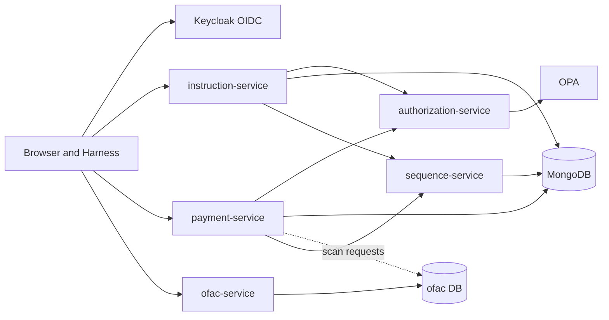
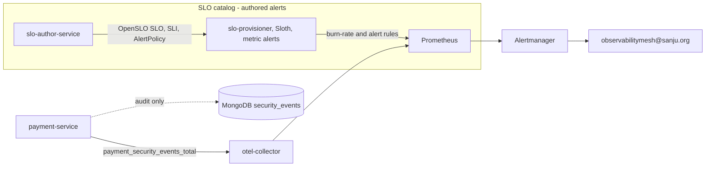

# Payment / OFAC demo workload

Policy-aware SSI cash instruction and payment lifecycle demo (trimmed port of [policy-pilot](https://github.com/sanjuthomas/policy-pilot)). Exercises the [observability mesh](../../README.md) end-to-end: OTLP telemetry, OpenSLO authoring, Sloth-provisioned Prometheus rules, and Grafana SLO dashboards. Emits `sanction_scan_completed_total` and other metrics consumed by the seeded SLIs.

## Architecture



OpenSLO authoring (`slo-author-service`) and SLO provisioning (`slo-provisioner-service`) are part of the included platform stack; see the root [README](../../README.md#observability) for that path.

**In scope:** instruction, payment, authorization, sequence, and OFAC services; demo harness; per-service browser UIs; OPA policies; Keycloak seed; MongoDB bitemporal documents.

**Out of scope (by design):** Kafka, Neo4j, indexer, chat/RAG.

## Services

| Service | Port | Role |
|---------|------|------|
| `instruction-service` | 9000 | Cash instruction lifecycle |
| `payment-service` | 9093 | Payment lifecycle + OFAC scan request creation |
| `ofac-service` | 9096 | Sanction scan simulator |
| `authorization-service` | 9094 | OPA-backed policy evaluation |
| `sequence-service` | 9095 | ID sequences |
| `demo-harness` | 9091 | Demo actions and seeding |

Also includes **MongoDB**, **OPA**, **opa-policy-seed**, and **Keycloak** (`oidc/`) used only by this workload.

Starting this workload also starts the shared observability platform via `include: ../../platform/docker-compose.yml`. Copy `.env.example` → `.env` to pin ports; defaults match `PORT_BLOCK=0`. See [workloads/_template/README.md](../_template/README.md) for running multiple isolated tenants in parallel.

Platform services (Grafana, Prometheus, SLO author, etc.) use the same `PORT_BLOCK` offsets — see [Platform URLs](#platform-urls) and `.env.example`.

## Observability

Instrumented Spring services depend on `shared/payment-ofac-telemetry`, which bundles:

- **Metrics** — Micrometer OTLP export (`management.otlp.metrics.export.url`)
- **Traces** — OpenTelemetry Spring Boot starter (`otel.exporter.otlp.endpoint`, `OTEL_EXPORTER_OTLP_*` env vars)

Docker Compose sets `OTEL_EXPORTER_OTLP_ENDPOINT=http://otel-collector:4318` and per-service `OTEL_SERVICE_NAME`. See the root [README](../../README.md#observability) for collector pipelines and backend URLs.

This workload overrides platform SLO services to enable Keycloak JWT auth and seeds OpenSLO documents via `postgres/seed-slos.sql`. The provisioner datasource allowlist is `payment-prometheus` (set in `docker-compose.yml`).

**Metric-based alerts from this workload**



SLO breach and payment-approval security alerts both follow the catalog path above. Author `AlertPolicy`, `AlertCondition`, and a `thresholdMetric` `SLI` in slo-author; the provisioner compiles metric-threshold policies to `alert-{policyName}.yml`.

`payment_security_events_total` drives that security email; MongoDB security events power the browser UI only.

### Explore in Grafana

Platform navigation (SLO Overview panels, Tempo Explore, Alertmanager) is in the root [README](../../README.md#explore-in-grafana). This section is the **payment-ofac-demo** walkthrough.

Open http://localhost:3000 (`admin` / `admin`).

**Seed demo data first** (stack must be running):

```bash
./scripts/seed-demo-data.sh --seed-only
```

Wait ~60–90 seconds after payment approvals so OFAC scans finish and `sanction_scan_completed_total` metrics reach Prometheus.

**SLO dashboard**

1. **Dashboards** → **SLOs** → **SLO Overview (Sloth)**
2. **service** = `payment-platform`
3. **SLO** = `sanction-scan-completion-30d-0` or `sanction-scan-latency-30d-0`

**Traces**

1. **Explore** → **Tempo** → **Search**
2. **Service name** — try `payment-service`, `ofac-service`, or `instruction-service`
3. Time range **Last 15 minutes** (or **Last 1 hour** if scans ran earlier)

**Metrics** (optional) — **Explore** → **Prometheus**: `rate(http_server_requests_seconds_count{service_name="instruction-service"}[5m])`

**Logs** — OpenSearch Dashboards http://localhost:5601 (index pattern `otel-logs*`)

**Email alerts (metric-based)** — configure SMTP in `.env` (see `.env.example`). Alerts email **`observabilitymesh@sanju.org`** when Prometheus rules fire on OTLP metrics:

| Alert | Metric / rule | Trigger |
|-------|---------------|---------|
| **SLO breach** | Sloth burn-rate rules (`sloth_severity=ticket` or `page`) from OpenSLO `SLO` + `SLI` | Error-budget burn rate exceeds Sloth thresholds |
| **Payment approval security ALERT** | OpenSLO `AlertPolicy` + `AlertCondition` + `SLI` (`thresholdMetric` on `payment_security_events_total`) → provisioner `alert-payment-approval-security-alert.yml` | Policy denies a payment `APPROVE`; counter incremented at denial time |

MongoDB `security_events` documents power the browser UI; the email alert uses the Prometheus counter, not a log or DB query.

Trigger a payment approval alert with the harness payment policy scenario: `./scripts/seed-demo-data.sh --seed-only` (includes `run-payment-policy-scenario`). Alertmanager UI: http://localhost:9098.

The harness is a **traffic generator** only — it is intentionally not instrumented for OTLP metrics, traces, or logs. Observability comes from the services it exercises.

### Trigger an SLO breach (demo)

`ofac-service` supports **demo mutants** that skew scan timing and results so seeded OpenSLO SLOs breach on purpose.

| Mutant mode | Env value | Effect |
|-------------|-----------|--------|
| Off (default) | `off` | Normal simulator (~1% `UNABLE_TO_DETERMINE`, 30–60s scan delay) |
| Latency | `latency` | Scans take **90–120s** → misses `duration_le="60s"` on `sanction-scan-latency-30d` |
| Completion | `completion` | **15%** `UNABLE_TO_DETERMINE` → breaches `sanction-scan-completion-30d` (99% target) |
| Both | `both` | Latency + completion mutants together |

1. In `.env` (see `.env.example`):

```bash
OBSERVABILITY_MESH_OFAC_MUTANT_MODE=both
```

2. Rebuild and restart OFAC:

```bash
docker compose up -d --build ofac-service
```

3. Generate OFAC traffic (approve payments so scan requests are created):

```bash
./scripts/seed-demo-data.sh --seed-only
```

4. Wait **2–3 minutes** for scans to finish and metrics to reach Prometheus.

5. In Grafana → **SLOs** → **SLO Overview (Sloth)**:
   - **service** = `payment-platform`
   - **SLO** = `sanction-scan-latency-30d-0` or `sanction-scan-completion-30d-0`
   - Time range **Last 30 minutes**

Optional: set `OBSERVABILITY_MESH_OFAC_MUTANT_PAYMENT_ID_PREFIX` to limit mutants to matching `payment_id` values only.

Prometheus check: `sum by (result, duration_le) (increase(sanction_scan_completed_total[5m]))`

## Sanction scanning (OFAC)

When a payment is **approved**, `payment-service` writes three documents in a **single MongoDB transaction**:

1. the new bitemporal payment version (`payments`),
2. a security event (`payment_service` in the `security_events` DB), and
3. an OFAC scan request (`scan-requests` in the `ofac` database) capturing payment id, owning LOB, debtor/creditor accounts, creditor name, and intermediaries.

`ofac-service` is a **fake sanction scanner** that simulates the vendor software large banks license rather than build (keeping pace with OFAC/Washington rule changes and the associated liability is hard). It runs a batch poll every **30 seconds**:

1. reads all **current** scan requests with `lifecycle_status = OPEN`,
2. claims each by appending a new version with `lifecycle_status = IN_PROGRESS`,
3. simulates the scan by waiting **30–60 seconds** (or **90–120s** when latency mutants are enabled), then
4. appends a final version with `lifecycle_status = PROCESSED` and a `result` of `PASSED` or `FAILED`.

Demo mutants (`observability-mesh.ofac.mutant-mode`) can raise the `UNABLE_TO_DETERMINE` rate and slow scans — see [Trigger an SLO breach (demo)](#trigger-an-slo-breach-demo).

Scan requests are versioned bitemporally (`in` / `out`, current sentinel `9999-12-31T23:59:59Z`) with `_id = {paymentId}|{paymentVersion}|{versionNumber}`, so each lifecycle transition is a new immutable version:

```
v1 OPEN  →  v2 IN_PROGRESS  →  v3 PROCESSED (PASSED | FAILED)
```

When a scan reaches `PROCESSED`, `ofac-service` increments `sanction_scan_completed_total` (Micrometer → OTLP → Prometheus) with a `result` label (`PASSED`, `FAILED`, or `UNABLE_TO_DETERMINE`). Definitive scans completed within 60 seconds of `requested_at` also carry `duration_le="60s"`, matching the seeded OpenSLO SLIs. The simulator returns `UNABLE_TO_DETERMINE` on roughly 1% of completions.

**OFAC scan browser** — http://localhost:9096/ui/ lists current scan requests from the `ofac` database with live polling. Filter by lifecycle status, result, or owning LOB; open a payment's scan detail from the table.

## Data stores

| Store | Databases / usage |
|-------|-------------------|
| MongoDB | `ssi_cash_activities` (instructions, payments), `ofac` (scan requests), `security_events` (audit) |
| PostgreSQL | `open_slo` — SLO catalog (platform, seeded by this workload) |

## Commands

From this workload directory (canonical entry point):

```bash
docker compose up -d --build
./scripts/seed-demo-data.sh --seed-only
```

From the **repository root** (convenience shim):

```bash
docker compose up -d
./workloads/payment-ofac-demo/scripts/seed-demo-data.sh --seed-only
```

Full stack + seed in one step:

```bash
./scripts/seed-demo-data.sh
```

Default demo password: `Password1!` (see [oidc/keycloak-seed/users.yaml](oidc/keycloak-seed/users.yaml)).

## Service URLs

Keycloak users for workload UIs share password **`Password1!`** — any `user_id` from [oidc/keycloak-seed/users.yaml](oidc/keycloak-seed/users.yaml) works. Platform operator default: **`admin-001`**.

| URL | Service | Username | Password |
|-----|---------|----------|----------|
| http://localhost:9000/ui/ | Instruction browser | `admin-001` | `Password1!` |
| http://localhost:9093/ui/ | Payment browser | `admin-001` | `Password1!` |
| http://localhost:9096/ui/ | OFAC scan browser | `admin-001` | `Password1!` |
| http://localhost:9094/ui/ | Authorization user directory | `admin-001` | `Password1!` |
| http://localhost:9091 | Demo harness | `admin-001` | `Password1!` |
| http://localhost:9090/ui/ | SLO authoring service | `admin-001` | `Password1!` |
| http://localhost:9097/ui/ | SLO provisioner browser | `admin-001` | `Password1!` |
| http://localhost:9080 | Keycloak admin console | `admin` | `admin` |
| http://localhost:9181 | OPA | — | — |

### Platform URLs

Included from `platform/docker-compose.yml` (same `PORT_BLOCK=0` defaults):

| URL | Service | Auth |
|-----|---------|------|
| http://localhost:3000 | Grafana | `admin` / `admin` |
| http://localhost:9092 | Prometheus UI | — |
| http://localhost:3200 | Tempo API | — |
| http://localhost:5601 | OpenSearch Dashboards | — |

## Development

```bash
./mvnw -pl workloads/payment-ofac-demo/instruction-service -am spring-boot:run
./mvnw -pl workloads/payment-ofac-demo/ofac-service -am spring-boot:run
./mvnw -pl workloads/payment-ofac-demo/payment-service -am verify
./mvnw -pl workloads/payment-ofac-demo -am verify
```

Run backing infrastructure and peer services:

```bash
docker compose up -d
```

Point a locally running service at the collector with `OTEL_EXPORTER_OTLP_ENDPOINT=http://localhost:4318`.

## Layout

```
workloads/payment-ofac-demo/
├── .env.example            # PORT_BLOCK=0 port map
├── docker-compose.yml      # includes platform/ + workload services
├── oidc/keycloak-seed/     # workload identity (Keycloak realm + users)
├── postgres/seed-slos.sql  # workload-specific OpenSLO seed
├── pom.xml                 # Maven aggregator
├── scripts/seed-demo-data.sh
├── shared/                 # payment-ofac-common, payment-ofac-auth, payment-ofac-telemetry, clients
├── authorization-service/
├── demo-harness/
├── instruction-service/
├── ofac-service/
├── opa-policy-seed/
├── payment-service/
└── sequence-service/
```

Platform libraries for SLO services (`shared/observability-mesh-auth`, `common`, `telemetry`) live at the repo root. This workload keeps its own copies under `shared/payment-ofac-*` so it does not depend on root shared modules for application code.

## Reset

OpenSLO catalog documents (2 SLIs + 2 SLOs + payment security alert bundle) live in `postgres/seed-slos.sql` and load automatically on **first** Postgres init when the data volume is created.

```bash
docker compose down -v --remove-orphans
docker compose up -d --build
./scripts/seed-demo-data.sh --seed-only
```

After `down -v`, Postgres initdb runs `01-init.sql` (schema) then `02-seed-slos.sql` (catalog). Wait ~60s for `slo-provisioner-service` to publish Sloth and alert rules.

If you rebuilt without `-v` and need to re-apply catalog rows (idempotent):

```bash
./scripts/apply-open-slo-seed.sh
```
